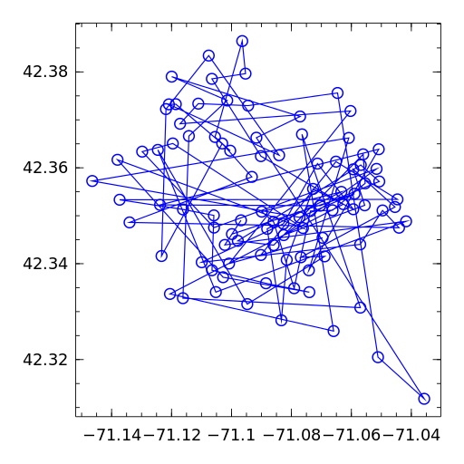
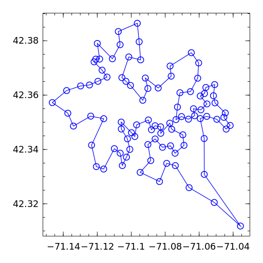

# Project Part 2

## Lecture Notes

The lecture notes are a pdf in the github repository.

## Installation Instructions (Recommended)

Please install the Winston package `Pkg.add("Winston")` (see [GitHub](https://github.com/nolta/Winston.jl) and [these instructions](http://homerreid.dyndns.org/teaching/18.330/InstallingWinston.shtml)).

Winston is a graphics package for Julia.  If you are unable to install
Winston, there is an alternate (less cool) version of the project that uses text instead of graphics.

Be sure that you have Julia and Gurobi working (i.e. that you completed the installation assignment for the [Modeling class](https://github.com/IainNZ/ORSoftwareTools2014/tree/master/Modelling).

## Assignment

We have provided an _enhanced solution_ to Project Part I, which we will be using in Part II.  Make sure you can run it!  We recommend you make a fresh start from Part I in a new directory, but you will have to repeat a few of the installation steps.  We have provided duplicates of a few scripts.

### If you were able to install Winston

* Navigate to the directory `winstonWorks`
* (Repeated from last time) Run `create_db.jl` to build the SQLite
database.  You should see a new file `stations.sqlite` in the working
directory.
* (Repeated from last time) Run `test_db.jl` to make sure
it is working.
* Run `tsp_service_winston.jl`. You should get a message like "Listening on 8000..."
* Open a browser and to go to http://localhost:8000/stationservice/42.3/42.4/-71.2/-71.0.  You should see a plot of the hubway stations on the x-y plane connected in a tour.  It should like this:

### If you were unable to successfully install Winston

* Navigate to the directory `winstonBroken`
* (Repeated from last time) Run `create_db.jl` to build the SQLite
database.  You should see a new file `stations.sqlite` in the working
directory.
* (Repeated from last time) Run `test_db.jl` to make sure
it is working.
* Run `tsp_service_text.jl`. You should get a message like "Listening on 8000..."
* Open a browser and to go to http://localhost:8000/stationservice/42.3/42.4/-71.2/-71.0.  You should see a list of hubway station names.

### Submission

Some information will be printed out to the terminal when you make a webpage request.  Paste it into a text file and submit the results on Stellar.

## When you are done

Your `tsp_service_winston.jl` will produce the 57km tour of the hubway stations below!!!

You can also solve some of the easier problems from [TSPLIB](http://comopt.ifi.uni-heidelberg.de/software/TSPLIB95/)

